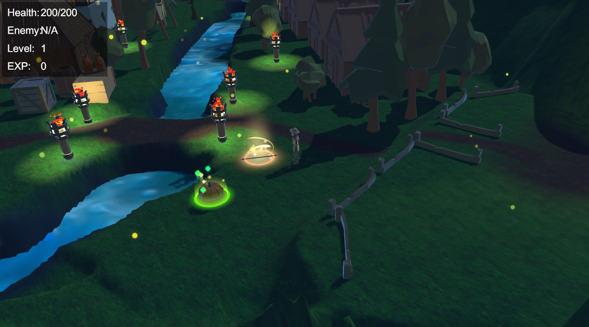

# Adventure RPG

> Unity 3D 전투 기반 RPG 게임 — 클릭 이동, 전투, 무기 장착, 세이브/로드 시스템까지 완비된 어드벤처.
> A Unity 3D action RPG featuring click-to-move, combat, weapon pickup, and save/load functionality.

<p align="center">
  <a href="#demo">🎮 플레이 영상</a> •
  <a href="#features">⚔️ 주요 특징</a> •
  <a href="#tech-stack">🧰 기술 스택</a> •
  <a href="#setup">⚙️ 설치/실행</a> •
  <a href="#screenshots">🖼️ 스크린샷</a>
</p>

<p>
  
  
</p>

---

## TL;DR

* **장르**: 3D 액션 RPG
* **엔진**: Unity 2021.3.45 (LTS)
* **역할(Role)**: 기획 100%, 프로그래밍 100%, 아트 20% (Low-poly 리소스 활용)
* **플레이타임**: 약 15분 (기본 모험/전투 시퀀스)

---

<h2 id="demo">🎮 플레이 영상</h2>

* ▶️ **Gameplay Video**: 준비 중

> 플레이어는 마을을 탐험하고, 무기를 습득해 적을 처치하며 경험치를 쌓습니다.

---

<h2 id="features">⚔️ 주요 특징 / Features</h2>

* 🧭 **마우스 클릭 이동 시스템** — NavMesh 기반 경로 탐색 (좌클릭 이동)
* ⚔️ **전투 시스템** — 타겟 기반 공격, 애니메이션 및 데미지 연동
* 🪓 **무기 픽업 및 장착** — 필드 무기를 클릭하면 자동 장비
* 💾 **세이브/로드 시스템** — 파일 기반 저장/불러오기/삭제
* 🧠 **적 AI 시스템** — 추격 / 의심 / 순찰 상태 머신 구현
* 🏠 **씬 전환 및 시네마틱** — Timeline, Fader를 활용한 전환

---

<h2 id="tech-stack">🧰 기술 스택 / Tech Stack</h2>

**엔진**: Unity 2021.3.45 LTS (URP)

**언어**: C#

**툴체인**: Rider / Visual Studio Code / Git / Blender / Audacity

**핵심 시스템 구성**:

| 시스템                     | 설명                       |
| ----------------------- | ------------------------ |
| **NavMesh Agent**       | 이동 및 추적 AI 구현            |
| **Animator Controller** | 공격/피격/대기 상태 관리           |
| **ScriptableObject**    | 무기·스탯 데이터 관리             |
| **Saving System**       | ISaveable 기반 세이브/로드 구조   |
| **Cinemachine**         | 카메라 추적 및 전환              |
| **Timeline**            | 컷씬 연출 (CinematicTrigger) |

---

<h2 id="architecture">🏗️ 프로젝트 구조 / Architecture</h2>

```
Assets/
  RPG/
    Core/            → ActionScheduler, PersistentObjectSpawner 등 핵심 로직
    Control/         → PlayerController, AIController, IRaycastable, CursorType
    Combat/          → Fighter, Weapon, WeaponConfig, Projectile, CombatTarget
    Attributes/      → Health, HealthBar, HealthDisplay
    Stats/           → BaseStats, Experience, Stat, Progression
    Cinematics/      → CinematicTrigger, CinematicControlRemover
    Saving/          → SavingSystem, SaveableEntity, ISaveable
    SceneManagement/ → Fader, Portal, SavingWrapper
    Movement/        → Mover (NavMesh 기반 이동)
```

**설계 철학**:

* 모듈화된 구조 (Core / Control / Combat / Stats 등 단방향 의존성)
* 인터페이스 기반 통신 (`IAction`, `ISaveable`, `IRaycastable`)
* ScriptableObject로 데이터 주도형 설계 (무기, 스탯)


---

<h2 id="controls">🎮 조작법 / Controls</h2>

| 동작    | 조작         |
| ----- | ---------- |
| 이동    | 마우스 좌클릭    |
| 공격    | 적 클릭 (좌클릭) |
| 무기 줍기 | 무기 클릭      |
| 저장    | S 키        |
| 불러오기  | L 키        |
| 삭제    | Delete 키   |

---

<h2 id="screenshots">🖼️ 스크린샷 / Screenshots</h2>

<p align="center">
  
  
  
</p>

> 마을을 탐험하며 무기를 수집하고 전투를 통해 경험치를 쌓는 플레이 화면.

---

<h2 id="roadmap">🚀 향후 계획 / Roadmap</h2>

* [ ] 퀘스트 시스템 (NPC 대화 및 목표 추적)
* [ ] 보스 AI 및 전투 패턴 추가
* [ ] 인벤토리 및 장비창 UI 구현
* [ ] 저장 슬롯 시스템 확장
* [ ] 미니맵 및 퀘스트 트래커 추가

---

<h2 id="credits">👤 제작자 / Credits</h2>

* **기획·개발**: 김영무 (Kim YoungMoo)
* **아트 리소스**: Lowpoly Village Pack (Unity Asset Store)
* **사운드**: FreeSound.org / 자체 믹싱
* **참고 강의**: [강의 링크](https://www.udemy.com/course/rpg-core-combat-creater-intermediate-unity-c-korean/?kw=rpg+%EC%BD%94%EC%96%B4&src=sac&couponCode=MT251103G1)


---

<h2 id="contact">📬 연락처 / Contact</h2>

* **이메일**: [rladuan612@gmail.com](mailto:rladuan612@gmail.com)
* **포트폴리오**: [포트폴리오](https://www.naver.com)
